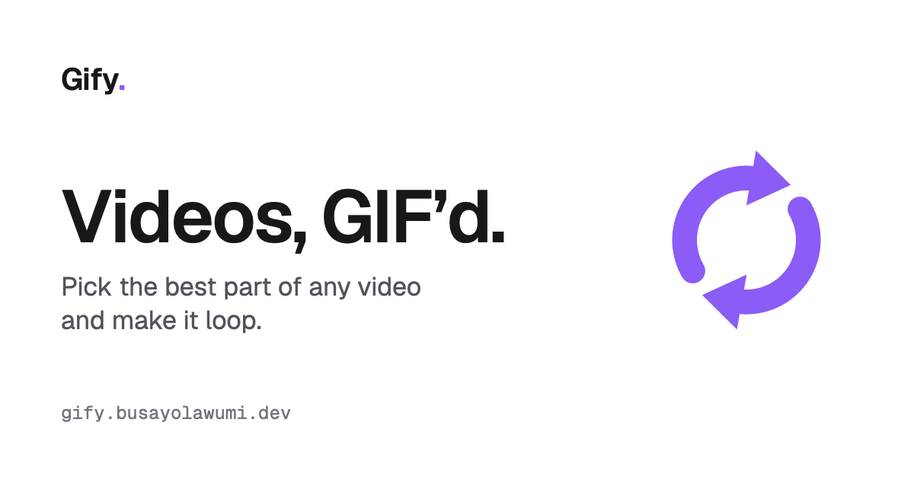
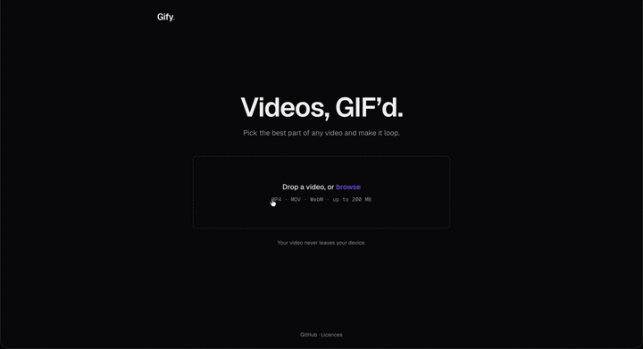

# Gify

**Videos, GIF’d.** Pick the best part of any video and make it loop.

**[gify.busayolawumi.dev](https://gify.busayolawumi.dev)**



<!--
  Demo GIF: record your screen using Gify, turn the recording into a GIF with
  Gify itself, save it as docs/demo.gif, and replace the image above with:
  
-->

## What it does

- **Drop in a video:** MP4, MOV or WebM up to 200 MB, including iPhone videos.
- **Trim it** on a timeline of thumbnails, up to 15 seconds.
- **Pick a size:** Small, Balanced, High, or set your own size and smoothness.
- **Download it, or share it** straight to other apps from your phone.

## Private by design

Everything happens in your browser. Your video is never uploaded anywhere, and
Gify removes location and device details from every GIF it makes.

## How it works

- **FFmpeg in the browser.** Conversion runs on
  [ffmpeg.wasm](https://github.com/ffmpegwasm/ffmpeg.wasm), FFmpeg compiled to
  WebAssembly. The ~32 MB engine (about 10 MB compressed) is served from the
  site itself, starts downloading as soon as a video is chosen, and is cached
  after the first visit.
- **Better colours.** GIFs only have 256 colours. Gify builds a palette from
  the clip's own colours first, then encodes with it, using a pattern dither
  that hides colour banding and stays stable between frames.
- **Sized for phones.** Presets set the _longer_ side, so portrait phone videos
  don't come out three times bigger than landscape ones.
- **Single-threaded on purpose.** The multi-threaded ffmpeg.wasm build
  deadlocks on iPhone (HEVC) video, so Gify uses the single-threaded one, which
  works everywhere.

## Licences

Gify's own code is under the [MIT licence](LICENSE).

Gify makes GIFs with [FFmpeg](https://ffmpeg.org) n5.1.4, using the prebuilt
ffmpeg.wasm engine (`@ffmpeg/core` 0.12.10). That engine is licensed under
**GPL-2.0-or-later**, and the site serves it unmodified:

- Source code and build scripts:
  [ffmpeg.wasm at the 0.12.10 core release](https://github.com/ffmpegwasm/ffmpeg.wasm/tree/71aa99d37c02a7b4c435275ca9ef50e612f6efa1)
- Licence text: [public/licenses.txt](public/licenses.txt), served at
  `/licenses.txt` and linked from the site's footer

## Stack

React, TypeScript, Vite, Tailwind CSS v4 and ffmpeg.wasm, hosted on Vercel.

## Running locally

```sh
npm install
npm run dev
```

| Command          | What it does                    |
| ---------------- | ------------------------------- |
| `npm run dev`    | Start the dev server            |
| `npm run build`  | Type-check and build to `dist/` |
| `npm run lint`   | Lint with Oxlint                |
| `npm run format` | Format with Prettier            |
